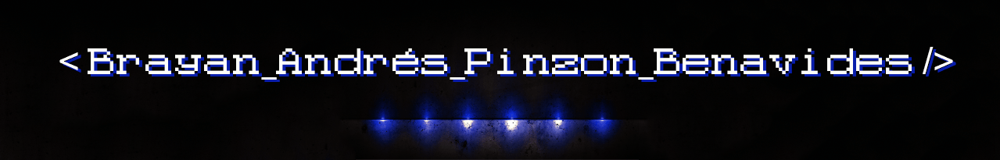

<!-- This is the README file for my profile, Some code in this file have been taken from "mctechnology17
" -->

<!-- Banner -->

<!-- Hello -->
<h1 align="center">< Hello_World /> I'm Brayan - Software Engineering Student </h1>

<!-- About Me -->

  
:zap: About me! 

### Software Engineering Student at the University of Cauca 💻🤓

- 🦾📓 I love challenges and continuous learning.
- 📱💻 I am currently learning mobile development and improving my skills as web developer.
- 👾 I am a strtategy game lover.
- 🤖 I'm really love VsCode.

<!-- Social media -->

  
  
  

<!-- Projects -->
<h3 align="center"> Latest Projects </h3>

<!-- Satori MMA -->
  <table>
  <tr>
    <td>
      
      <h4 align="center"> <a href="https://github.com/Satori-MMA" target="_blank">Satori MMA - Web Aplication</a> </h4>
      

        
see more...

        A web application for "Satori MMA Pasto" martial arts academy.
        They can offer courses to their clients.
      

    </td>
    <td>
      
      <h4 align="center"> <a href="https://github.com/MyUnicaucaGit/" target="_blank">Unicauca Repository</a> </h4>
        

          
see more...

        My personal repository of the university of cauca.
        There are many university projects like "delivery food", simulations of vibes and waves, python exercises and more.
        

    </td>
     <td>
      
      <h4 align="center"><a href="https://github.com/Notera-App" target="_blank">Notera App</a></h4>
        

          
see more...

        The approach of a platform presented at the yeapp hackathon.
        people can take notes in a different way and be able to generate study methods.
        

    </td>
  </tr>
  </table>

<!-- Languages -->
<h3 align="center">   Languages and Tools   </h3>

     
     
     
     
     
     
     
     
     
     
     
     
     
     
     
     
     
     

<!-- GitHub Stats -->
<h3 align="left"> GitHub Stats</h3>

  <a href="https://skyline.github.com/AndresPinzon14/2022">
  
  

<!-- Funny Animation -->

